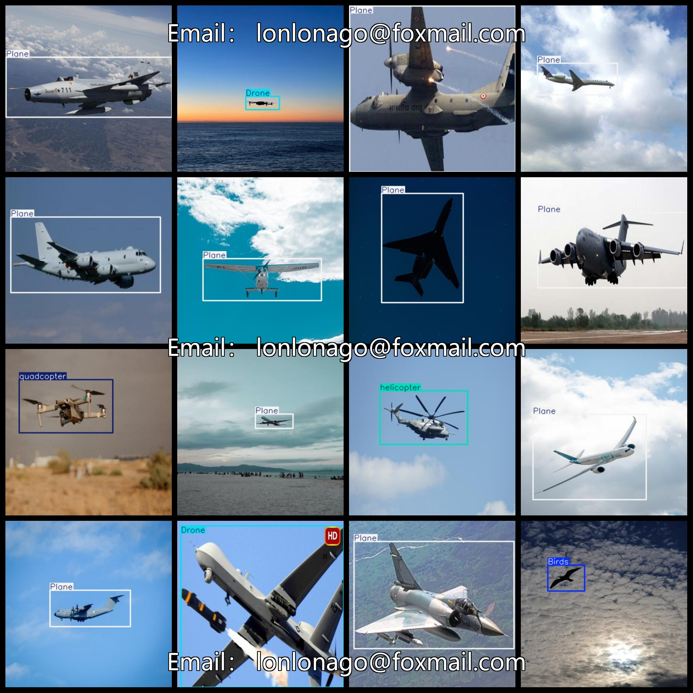
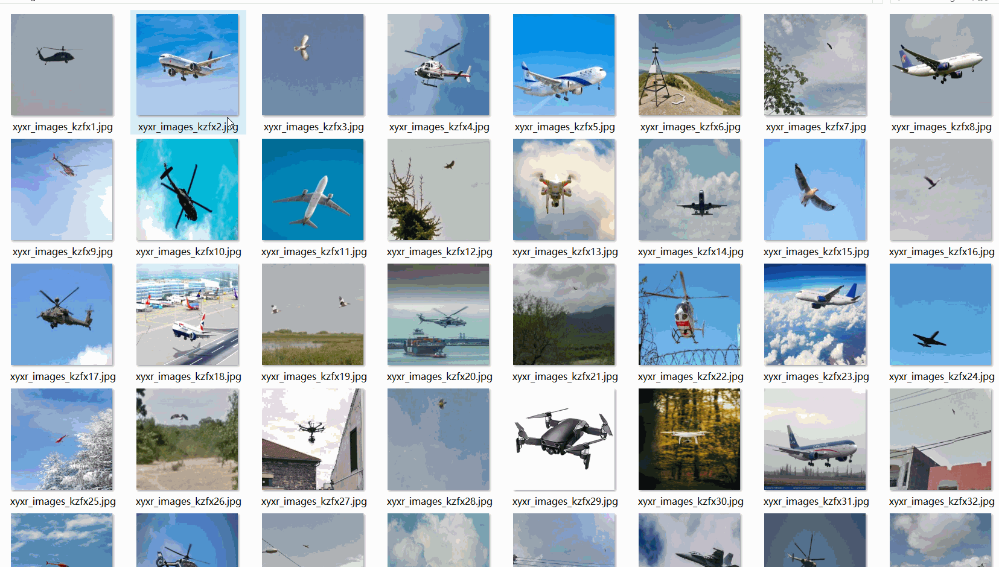

# Aerial Flying Object Detection Dataset

The aerial flying object detection dataset consists of 2627 images in VOC format and YOLO format. The dataset is divided into three folders: JPEGImages, Annotations, and labels.

The JPEGImages folder contains 2627 jpg images.

The Annotations folder contains 2627 xml files.

The labels folder contains 2627 txt files.

There are a total of 5 label categories, including "Birds", "Drone", "Plane", "helicopter", and "quadcopter".

Each label category has a different number of frames (note that the order of classes in the YOLO format does not match this, but it matches the classes.txt file in the labels folder).

- Birds have 539 frames
- Drone has 608 frames
- Plane has 947 frames
- Helicopter has 449 frames
- Quadcopter has 308 frames

The total number of frames is 2851.

All images are of high resolution (pixels).

They are not enhanced.

The github repository location is datasets_sl.

The shape of the labels is rectangular boxes, used for target detection recognition.

This dataset does not guarantee the accuracy or precision of any trained model or weight files, only accurate and reasonable annotations are provided.

The annotation and image situation is as follows:

## Images

---

Here is a pay link on Stripe (https://buy.stripe.com/3cs8yP7sY87d0vu9AB). Please contact me lonlonago@foxmail.com after funding $89, and I will send you a complete data files, thank you!

